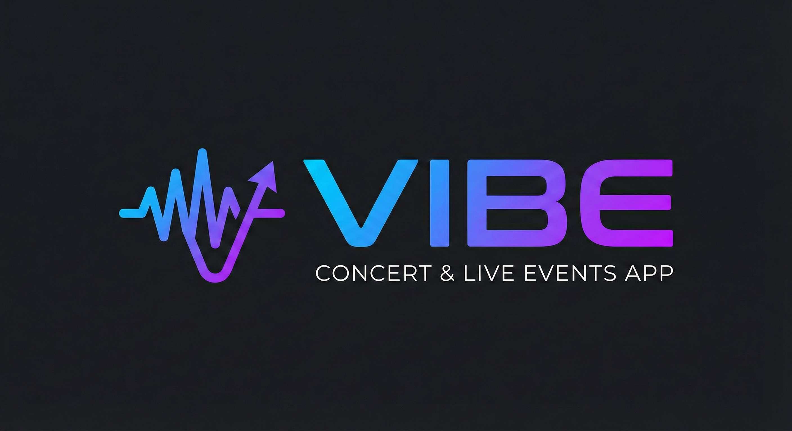
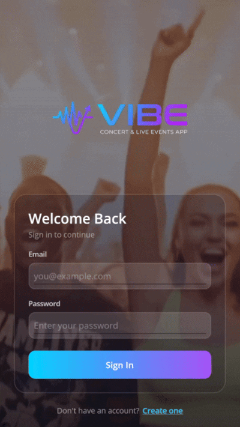
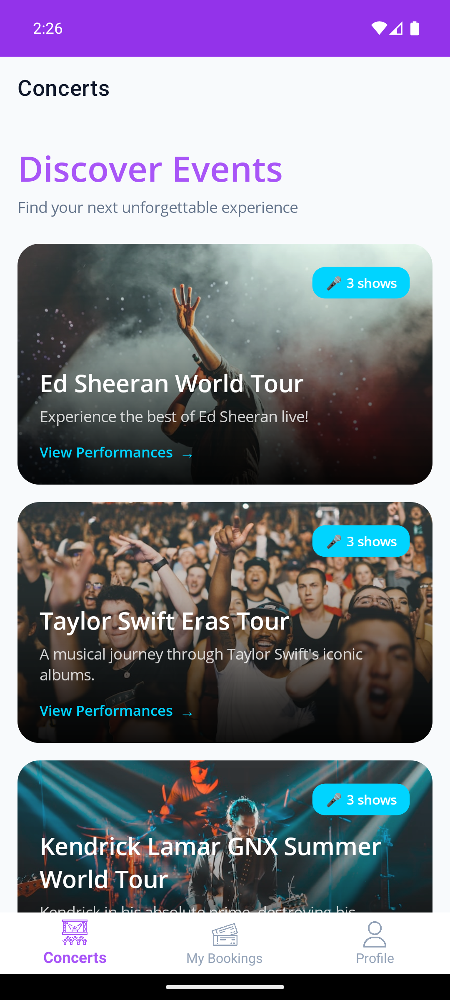
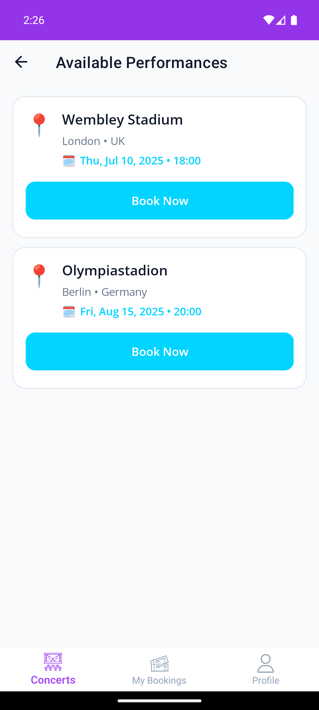
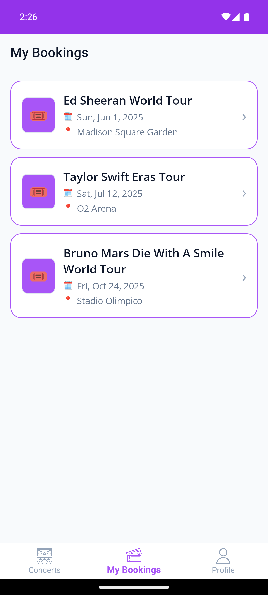
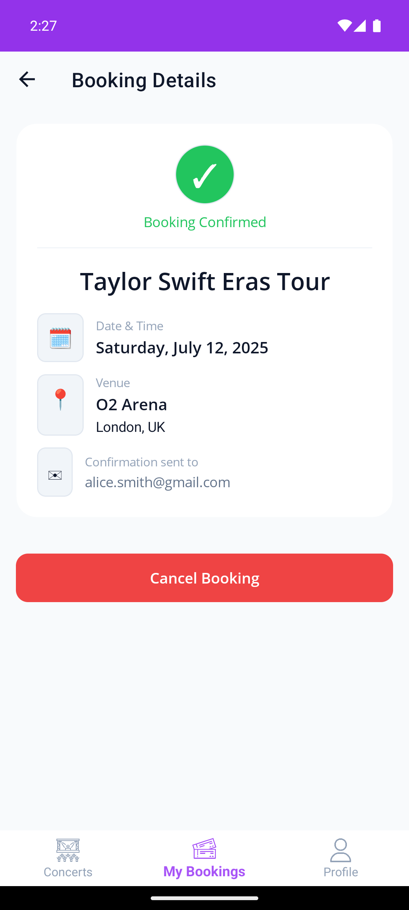
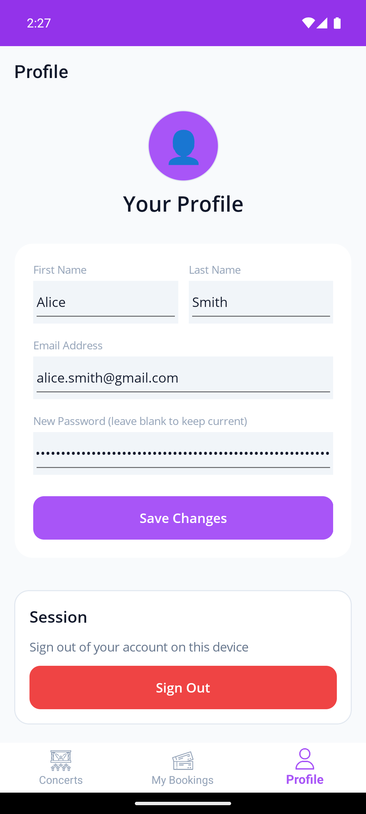
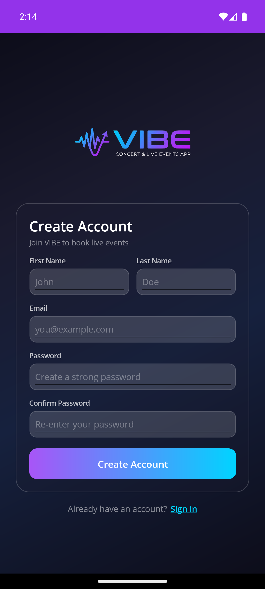
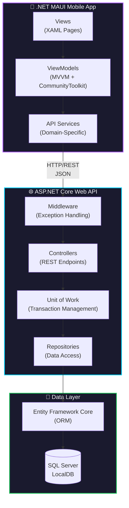

<p align="center">
  
</p>

<h1 align="center">VIBE - Concert & Live Events App</h1>

<p align="center">
  A full-stack .NET mobile application for discovering and booking concert tickets.
  <br/>
  Built with ASP.NET Core Web API and .NET MAUI for cross-platform mobile experiences.
</p>

<p align="center">
  
  
  
  
  
</p>

<p align="center">
  
  
  
  
</p>

---

## ✨ Features

- **🎫 Concert Discovery** - Browse a curated list of concerts with hero-style image cards
- **🎭 Performance Selection** - View available show dates, times, and venues
- **📱 Cross-Platform** - Runs on Android, iOS, Windows, and macOS
- **🔐 Secure Authentication** - BCrypt password hashing with secure login/registration
- **📖 My Bookings** - View and manage your booked tickets
- **👤 User Profile** - Update your personal information
- **🎨 Modern UI** - VIBE-branded dark theme with glassmorphism effects
- **🎬 Video Background** - Immersive login experience with concert video backdrop

---

## 📱 App Preview

<p align="center">
  
  <br/>
  <em>Immersive login experience with video background and glassmorphism design</em>
</p>

### Screenshots

<table>
  <tr>
    <td align="center">
      <br/>
      <em>Concert Discovery</em>
    </td>
    <td align="center">
      <br/>
      <em>Performance Selection</em>
    </td>
    <td align="center">
      <br/>
      <em>My Bookings</em>
    </td>
  </tr>
  <tr>
    <td align="center">
      <br/>
      <em>Booking Confirmation</em>
    </td>
    <td align="center">
      <br/>
      <em>User Profile</em>
    </td>
    <td align="center">
      <br/>
      <em>Registration</em>
    </td>
  </tr>
</table>

---

## 🏗️ Architecture

This application follows a **clean architecture** pattern with clear separation of concerns:



### Project Structure

```
DMA-AU24-LAB2-Group4/
├── DMA-AU24-LAB2-Group4.API/          # ASP.NET Core Web API
│   ├── Controllers/                    # REST API endpoints
│   ├── Middleware/                     # Global exception handling
│   └── Profiles/                       # AutoMapper configurations
│
├── DMA-AU24-LAB2-Group4.Data/         # Data Access Layer
│   ├── Entity/                         # EF Core entity models
│   ├── Repository/                     # Repository pattern implementation
│   ├── Migrations/                     # EF Core migrations
│   └── ApplicationDbContext.cs         # Database context with Fluent API
│
├── DMA-AU24-LAB2-Group4.Data.DTO/     # Data Transfer Objects
│   └── (Shared DTOs for API contracts)
│
├── DMA-AU24-LAB2-Group4.MAUI/         # .NET MAUI Mobile App
│   ├── Views/                          # XAML UI pages
│   ├── ViewModels/                     # MVVM ViewModels
│   ├── Services/                       # Domain-specific API services
│   ├── Models/                         # Client-side models
│   └── Resources/                      # Styles, colors, images, videos
│
└── DMA-AU24-LAB2-Group4.Test/         # Unit & Integration Tests
    └── (xUnit tests with Moq)
```

---

## 🛠️ Technology Stack

### Backend (API)

| Technology | Purpose |
|------------|---------|
| **ASP.NET Core 8** | Web API framework |
| **Entity Framework Core** | Object-Relational Mapping |
| **SQL Server LocalDB** | Development database |
| **AutoMapper** | Object-to-object mapping |
| **BCrypt.Net** | Secure password hashing |
| **Swagger/OpenAPI** | API documentation |

### Mobile (MAUI)

| Technology | Purpose |
|------------|---------|
| **.NET MAUI 9** | Cross-platform UI framework |
| **CommunityToolkit.Mvvm** | MVVM architecture support |
| **CommunityToolkit.Maui** | UI components & converters |
| **AutoMapper** | DTO to model mapping |
| **MediaElement** | Video playback for login |

### Testing

| Technology | Purpose |
|------------|---------|
| **xUnit** | Test framework |
| **Moq** | Mocking framework |
| **EF Core InMemory** | In-memory database for tests |

---

## 🚀 Getting Started

### Prerequisites

- [.NET 9 SDK](https://dotnet.microsoft.com/download/dotnet/9.0) and the [.NET 8 runtime](https://dotnet.microsoft.com/download/dotnet/8.0) (the API and tests target .NET 8, the MAUI app .NET 9)
- [EF Core CLI tools](https://learn.microsoft.com/en-us/ef/core/cli/dotnet): `dotnet tool install --global dotnet-ef`
- [Visual Studio 2022](https://visualstudio.microsoft.com/) (17.8+) with:
  - ASP.NET and web development workload
  - .NET MAUI workload
- [SQL Server LocalDB](https://docs.microsoft.com/en-us/sql/database-engine/configure-windows/sql-server-express-localdb) (included with Visual Studio)
- Android Emulator or physical device (for mobile testing)

### Installation

1. **Clone the repository**

   ```bash
   git clone https://github.com/Abdriano95/VIBE-ConcertBookingApp.git
   cd VIBE-ConcertBookingApp
   ```

2. **Restore dependencies**

   ```bash
   dotnet restore
   ```

3. **Apply database migrations**

   ```bash
   dotnet ef database update --project DMA-AU24-LAB2-Group4.Data --startup-project DMA-AU24-LAB2-Group4.Data
   ```

4. **Run the API**

   ```bash
   dotnet run --project DMA-AU24-LAB2-Group4.API
   ```

   The API will be available at:
   - HTTP: `http://localhost:5000`
   - Swagger UI: `http://localhost:5000/swagger`

5. **Run the MAUI app**

   ```bash
   dotnet build DMA-AU24-LAB2-Group4.MAUI -f net9.0-android
   # Or use Visual Studio to deploy to emulator/device
   ```

### Running with Visual Studio

1. Open `DMA-AU24-LAB2-Group4.sln` in Visual Studio 2022
2. Right-click the solution → **Set Startup Projects** → **Multiple startup projects**
3. Set both `DMA-AU24-LAB2-Group4.API` and `DMA-AU24-LAB2-Group4.MAUI` to **Start**
4. Press **F5** to run both projects

### Test Credentials

The database is seeded with test users:

| Email | Password |
|-------|----------|
| `john.doe@example.com` | `Password123!` |
| `jane.smith@example.com` | `Password456!` |

---

## 🧪 Running Tests

```bash
# Run all tests
dotnet test

# Run with verbose output
dotnet test --logger "console;verbosity=detailed"

# Run specific test project
dotnet test DMA-AU24-LAB2-Group4.Test
```

**Test Coverage:**
- ✅ Password Security (16 tests)
- ✅ Exception Middleware (24 tests)
- ✅ Booking Repository (1 test)

---

## 📡 API Documentation

The API provides full Swagger documentation with XML comments on all endpoints.

### Endpoints Overview

| Method | Endpoint | Description |
|--------|----------|-------------|
| `GET` | `/api/Concert` | List all concerts |
| `GET` | `/api/Concert/{id}` | Get concert by ID |
| `GET` | `/api/Performance` | List all performances |
| `GET` | `/api/Performance/{id}` | Get performance by ID |
| `GET` | `/api/Performance/concert/{id}` | Get performances by concert |
| `GET` | `/api/Performance/available/{concertId}/{customerId}` | Get available performances |
| `POST` | `/api/Customer/register` | Register new customer |
| `POST` | `/api/Customer/login` | Authenticate customer |
| `GET` | `/api/Customer/{id}` | Get customer profile |
| `POST` | `/api/Customer/getBookings` | Get a customer's bookings (customer ID in the request body) |
| `PUT` | `/api/Customer/update` | Update customer profile |
| `GET` | `/api/Booking` | List all bookings |
| `GET` | `/api/Booking/customer/{customerId}` | Get customer's bookings |
| `POST` | `/api/Booking` | Create new booking |
| `DELETE` | `/api/Booking/{id}` | Cancel booking |

---

## 🎨 Design System

### VIBE Color Palette

| Color | Hex | Usage |
|-------|-----|-------|
| 🟣 VIBE Purple | `#A855F7` | Primary brand color |
| 🔵 VIBE Cyan | `#00D4FF` | Accent color, CTAs |
| ⬛ Background | `#0D0D1A` | App background |
| 🟫 Card | `#1A1A2E` | Card surfaces |
| ⬜ Text | `#F8FAFC` | Primary text |

### UI Components

- **Glassmorphism cards** with semi-transparent backgrounds
- **Gradient buttons** (Cyan → Purple / Purple → Cyan)
- **Video backgrounds** using MediaElement
- **Pull-to-refresh** on all list pages
- **Loading overlays** with ActivityIndicator
- **Hero-style concert cards** with image backgrounds

---

## 🔐 Security Features

- **BCrypt Password Hashing** - Passwords are never stored in plain text
- **Secure API Endpoints** - Structured error responses without sensitive data exposure
- **Global Exception Middleware** - Catches unhandled exceptions and returns appropriate HTTP status codes
- **Environment-Aware Logging** - Stack traces only exposed in development mode

---

## 📈 Build Quality

This project maintains high code quality standards:

- ✅ **0 Build Warnings** - Clean compilation
- ✅ **0 Build Errors** - Stable codebase
- ✅ **41/41 Tests Passing** - Password security, exception middleware and booking repository
- ✅ **Compiled XAML Bindings** - Better performance
- ✅ **Structured Logging** - ILogger in the exception middleware and the MAUI services and view models

---

## 👥 Authors

- **Abdulla Mehdi** - [GitHub](https://github.com/Abdriano95)
- **Joakim Olsson** - [GitHub](https://github.com/joakimolssonn)

VIBE started as a two-person group project in the Development of Mobile Applications course (autumn 2024). In January 2026 Abdulla Mehdi continued the project alone: BCrypt password hashing, the global exception middleware, the redesigned MAUI UI, and the password security and exception middleware test suites (40 of the 41 tests).

---

## 📄 License

This project is licensed under the MIT License - see the [LICENSE.txt](LICENSE.txt) file for details.

---

## 🙏 Acknowledgments

- University of Borås - Development of Mobile Applications course
- [.NET MAUI Community Toolkit](https://github.com/CommunityToolkit/Maui)
- [Unsplash](https://unsplash.com/) - Concert images for seed data

---

<p align="center">
  Made with 💜 and .NET
</p>
